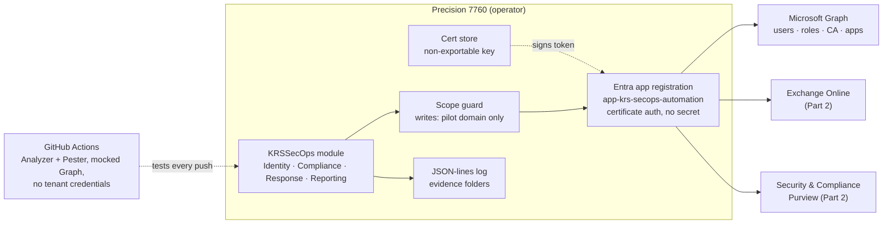

# M365 SecOps Automation Toolkit (KRSSecOps)

[](https://github.com/kingsrule50/m365-secops-automation-toolkit/actions/workflows/ci.yml)


## Executive summary

I built **KRSSecOps**, a PowerShell 7 module that audits and protects a Microsoft 365 tenant across Entra ID, Exchange Online and Purview. It authenticates with a certificate, never a secret. It is locked to a pilot domain for every change, tested with Pester on every push, and leaves a structured audit trail for everything it does.

This is a three-part lab. **Part 1** (this release) is the module foundation and an identity posture audit that answers "where are we exposed?" with one command.

| Part | Focus | Status |
| --- | --- | --- |
| 1 | Module foundation and Entra ID identity posture audit | Done |
| 2 | Compliance-as-code: Purview baseline export, drift detection and redeploy, Exchange risk checks | Next |
| 3 | Detection, safe containment, evidence packages, executive report | Planned |

## The problem

Identity is where most Microsoft 365 breaches start: an admin with no MFA, a standing Global Administrator, a forgotten account, an app secret nobody owns. Checking these through the admin portals is slow and easy to get wrong, and the result is a screenshot rather than evidence anyone can repeat.

I also had a real constraint: the lab runs in a **shared developer tenant** that I don't own. Anything I automate has to be safe for other people's users and data.

## The solution

I wrote the checks as code that a security team could run every week:

- **One command, six checks.** `Invoke-KRSIdentityAudit` covers MFA gaps, stale accounts, standing privileged access, guests, app credentials and permissions, and Conditional Access gaps. It writes a timestamped evidence folder with CSVs, a ranked `findings.csv` and a `summary.json`.
- **Certificate-only, app-only auth.** The private key is non-exportable and never leaves my workstation. There are no client secrets anywhere.
- **Least privilege.** Six read-only Graph permissions for Part 1, granted part by part. I avoided `Directory.Read.All` by using typed endpoints.
- **Built for a shared tenant.** Reports default to the pilot population. `-Redact` masks everyone outside it. Every future write passes a scope guard that refuses any account outside `@m365.kingsruleusa.com`.
- **Engineered like production code.** Strict mode, approved verbs, comment-based help on every function, retry and paging on every Graph call, JSON-lines logging with correlation IDs, Pester tests with mocks, PSScriptAnalyzer and CI on Windows and Ubuntu.

## Architecture



## What the audit checks

| Check | Function | Flags | Graph source |
| --- | --- | --- | --- |
| MFA coverage | `Get-KRSMfaGap` | Critical: admin with no MFA. High: user with no MFA. Medium: admin with no phishing-resistant method | `reports/authenticationMethods/userRegistrationDetails` |
| Stale accounts | `Get-KRSStaleAccount` | Enabled accounts with no sign-in past the threshold, or never signed in | `users` with `signInActivity` |
| Privileged access | `Get-KRSPrivilegedRoleReport` | Standing privileged roles on users, apps or groups. Global Admin count outside 2 to 4 | PIM schedule instances, role definitions |
| Guests | `Get-KRSGuestAccessReport` | Unredeemed invitations, inactive guests | `users` (guests) |
| App risk | `Get-KRSAppCredentialRisk` | Credentials expiring soon, long-lived secrets, apps holding privilege-escalation permissions | `applications`, Graph `appRoleAssignedTo` |
| Conditional Access | `Get-KRSConditionalAccessInventory` | No MFA for all users, legacy auth not blocked, disabled or report-only policies, excessive exclusions | `identity/conditionalAccess/policies` |

## Quick start

Full step-by-step instructions are in **[docs/runbook-part1.md](docs/runbook-part1.md)**.

```powershell
./setup/01-Install-Prerequisites.ps1
./setup/02-New-KRSAuthCertificate.ps1
./setup/03-New-KRSAppRegistration.ps1 -TenantId <tenant> -CertificatePath <cer> -WhatIf
./setup/04-New-KRSPilotUsers.ps1 -TenantId <tenant> -WhatIf
# copy Config/settings.example.json to settings.json and fill it in

Import-Module ./src/KRSSecOps/KRSSecOps.psd1
Connect-KRSTenant
Invoke-KRSIdentityAudit -Scope Tenant -Redact
```

## Repository layout

```
src/KRSSecOps/            the module
  Public/Core/            connect, disconnect, pilot scope test
  Public/Identity/        Part 1 checks and the audit orchestrator
  Private/                Graph wrapper, config, logging, scope guard, redaction
  Config/                 settings.example.json (settings.json is gitignored)
setup/                    one-time setup scripts, all with -WhatIf
tests/                    Pester 5 tests, Graph fully mocked
build/                    build.ps1 and analyzer settings
docs/                     runbook, permission matrix, change log, screenshots
.github/workflows/ci.yml  analyze, test and package on Windows and Ubuntu
```

## Technologies

| Area | Technology |
| --- | --- |
| Language | PowerShell 7.4 (module, manifest, strict mode) |
| Identity platform | Microsoft Entra ID (P2), PIM, Conditional Access |
| API | Microsoft Graph v1.0 via Microsoft.Graph.Authentication |
| Authentication | Entra app registration, X.509 certificate, app-only |
| Testing | Pester 5 with mocks and code coverage |
| Quality | PSScriptAnalyzer (PSGallery rules plus formatting and compatibility) |
| CI | GitHub Actions on windows-latest and ubuntu-latest |

## Security design

- **Permissions:** see [docs/permission-matrix.md](docs/permission-matrix.md). Part 1 is read-only.
- **Secrets:** none. The certificate's private key is non-exportable. `settings.json`, `.cer` and `.pfx` files are gitignored, and a test fails the build if a client secret ever appears in the code.
- **Blast radius:** the pilot is `@m365.kingsruleusa.com` plus the `SG-KRS-SecOps-Pilot` group. Writes require the pilot domain itself, because group membership can be changed by others. The guard rejects look-alike subdomains and guest accounts, and every rejection is logged.
- **Data handling:** reports go to `%USERPROFILE%\KRSSecOps\reports`, outside the repo. `-Redact` masks every identity outside the pilot.
- **Change control:** every tenant change in this lab is recorded with the tenant owner's approval in [docs/change-log.md](docs/change-log.md).

## Why this matters

Security teams don't need another person who can click through the Entra portal. They need people who can turn a control into code that runs the same way every time, produces evidence and is safe to run. This project shows I can:

- automate Microsoft 365 security at the API level instead of the portal
- apply least privilege and secretless authentication to my own tooling
- design guardrails for working in an environment I don't own
- write PowerShell that another engineer can read, test, review and maintain

## Skills demonstrated

Microsoft Graph API · Entra ID security posture · Privileged Identity Management · Conditional Access · app registration security · certificate-based authentication · least privilege · PowerShell module design · Pester testing and mocking · PSScriptAnalyzer · GitHub Actions CI · structured logging and audit trails · change management in a shared tenant
