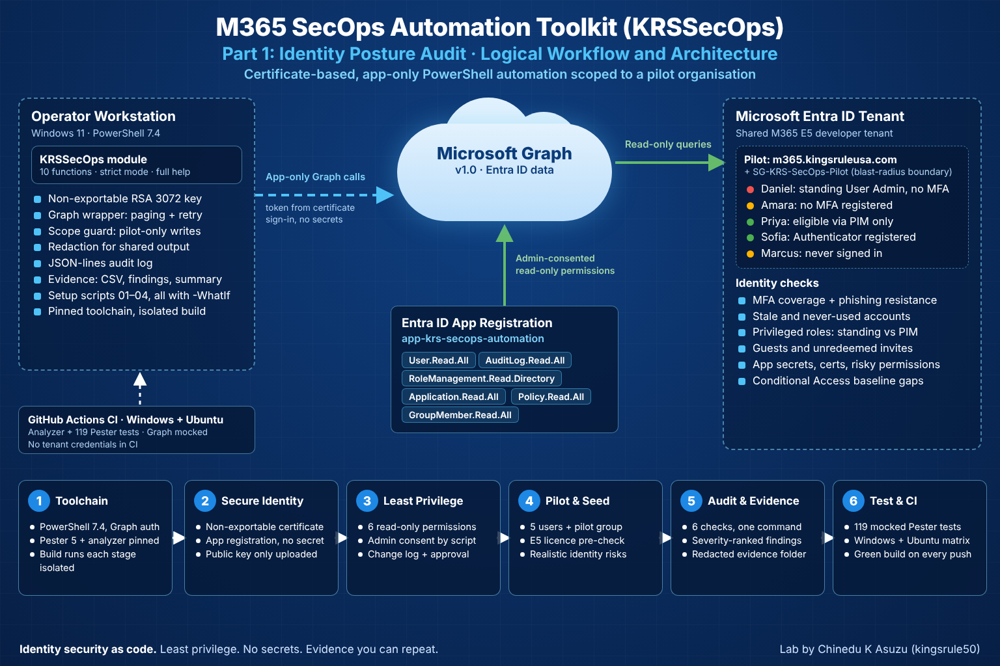
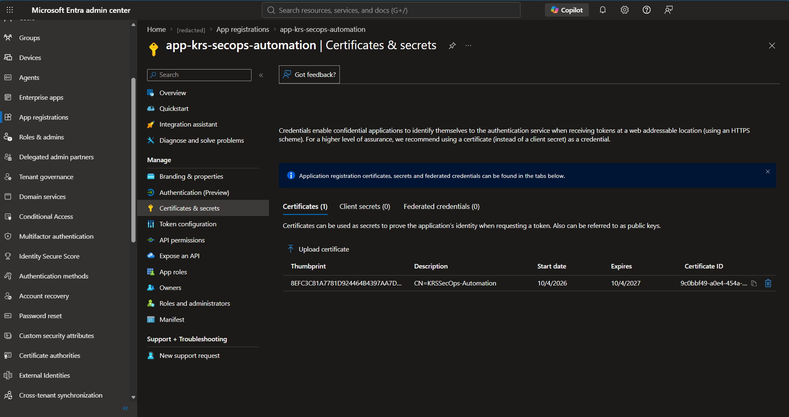
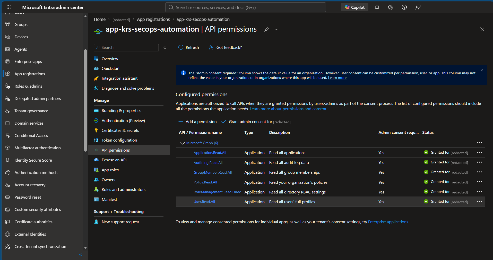
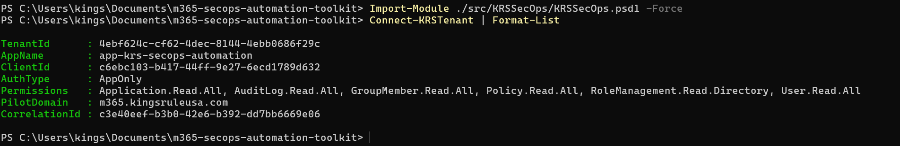
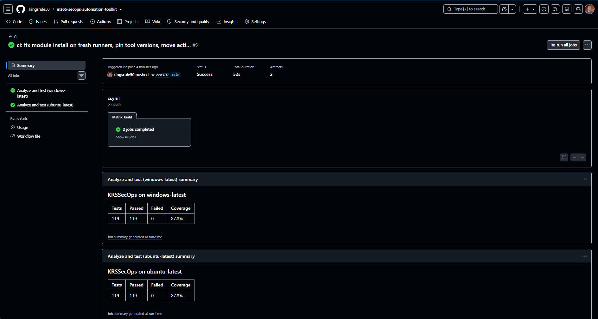

# M365 SecOps Automation Toolkit — Part 1: Identity Posture Audit


[](https://github.com/kingsrule50/m365-secops-automation-toolkit/actions/workflows/ci.yml)

**An enterprise-grade PowerShell module that audits a Microsoft 365 tenant's identity security posture with one command — certificate-only authentication, least-privilege Graph permissions, a pilot-scoped blast radius, and a tested, CI-verified codebase.**

> **Series:** Part 1 of 3 — Identity posture audit (this repo) · Part 2 — Compliance-as-code for Purview and Exchange · Part 3 — Detection, safe containment and reporting

---

## The Problem This Lab Solves

Most Microsoft 365 breaches start with identity: an administrator without MFA, a standing Global Administrator, an account nobody has used in months, or an app secret nobody owns. Checking for these in the admin portals is slow, inconsistent and produces screenshots instead of repeatable evidence.

I also had a real-world constraint. I ran this lab in a **shared Microsoft 365 developer tenant that I do not own**, used by other people. Anything I automated had to be safe for their users and data — the same constraint a consultant or new security engineer faces in a production tenant.

In this project, I built **KRSSecOps**, a PowerShell 7 module that turns six identity security checks into code. It authenticates with a certificate instead of a secret, holds only read-only permissions, limits every change to a pilot domain, and produces a ranked, redacted evidence folder from a single command.

---

## Project Objectives

I designed this lab to demonstrate my ability to:

- Build a production-style PowerShell module (manifest, strict mode, approved verbs, comment-based help)
- Authenticate automation with a **non-exportable certificate** and **app-only** access — no client secrets anywhere
- Apply **least privilege**: six read-only Microsoft Graph permissions, granted and documented per lab part
- Control blast radius in a shared tenant with a **pilot domain, a pilot group and a write-side scope guard**
- Audit MFA coverage, stale accounts, standing privileged access, guests, app credentials and Conditional Access
- Produce severity-ranked findings and **redacted evidence** safe to share
- Prove the code works with **119 Pester tests** and **GitHub Actions CI** on Windows and Ubuntu
- Follow a change-control workflow: preview with `-WhatIf`, record approval, apply, validate

---

## Technologies Used

| Area | Technology |
| --- | --- |
| Language | PowerShell 7.4 (module + manifest, `Set-StrictMode -Version Latest`) |
| Identity platform | Microsoft Entra ID P2, Privileged Identity Management, Conditional Access |
| API | Microsoft Graph v1.0 via Microsoft.Graph.Authentication 2.41 |
| Authentication | Entra ID app registration, X.509 certificate (RSA 3072, non-exportable), app-only |
| Testing | Pester 5.9 with mocks and code coverage (87%) |
| Static analysis | PSScriptAnalyzer 1.23 (PSGallery rules + formatting, compatibility, parse errors) |
| CI | GitHub Actions — matrix build on `windows-latest` and `ubuntu-latest` |
| Licensing | Microsoft 365 E5 (pilot users) |

---

## Lab Environment

I performed this project in a shared **Microsoft 365 E5 developer tenant**. My dedicated domain in that tenant, **m365.kingsruleusa.com**, is the pilot organisation and the automation's blast-radius boundary.

| Resource | Purpose |
| --- | --- |
| **app-krs-secops-automation** | Automation identity: certificate credential only, 6 read-only Graph permissions |
| **CN=KRSSecOps-Automation** | Authentication certificate, RSA 3072 / SHA-256, private key non-exportable |
| **SG-KRS-SecOps-Pilot** | Pilot security group — read-side scope for reports |
| **Amara Okafor** (Finance) | Signed in, never registered MFA — *no-MFA scenario* (E5) |
| **Daniel Reyes** (HR) | Permanent active User Administrator, no MFA, never signed in — *standing-access scenario* |
| **Priya Shah** (IT Operations) | Security Reader, **eligible only** through PIM — *"done right" contrast* |
| **Marcus Bennett** (Sales) | Never signed in — *stale-account scenario* (E5) |
| **Sofia Laurent** (Legal) | Microsoft Authenticator registered — *compliant baseline* (E5) |
| **app-krs-demo-legacy** | Demo app with a client secret expiring in 7 days — *credential-expiry scenario* |

I used test identities and controlled scenarios throughout. Every tenant change was approved by the tenant owner and recorded in [docs/change-log.md](docs/change-log.md).

---

## Architecture and Logical Workflow

I designed the toolkit around a single certificate-authenticated automation identity, a central Graph wrapper, and a pilot boundary that every write must pass.


*The operator workstation signs in with a non-exportable certificate and receives an app-only token carrying six admin-consented, read-only permissions. All Graph traffic passes through one wrapper (paging, throttling retry, logging). CI tests the module on every push with Graph fully mocked.*

The audit workflow is:

**Certificate sign-in → App-only token → Six identity checks via Microsoft Graph → Severity ranking → Redacted evidence folder**

**Design decisions I made:**

- **Certificate, never a secret.** The private key is created non-exportable in the Windows certificate store, so it cannot be copied off the workstation. Only the public key is uploaded to Entra ID. A test fails the build if the words `ClientSecret` ever appear in the code.
- **Typed Graph endpoints instead of `Directory.Read.All`.** Resolving users, groups and service principals through their own endpoints let me avoid one of the broadest read permissions in Graph.
- **Two pilot rules, not one.** Reads treat the pilot as the domain *or* the pilot group. Writes (Parts 2 and 3) require the **pilot domain itself**, because group membership can be changed by other people. The guard rejects look-alike subdomains and guest accounts, and logs every rejection.
- **One wrapper for every Graph call.** Paging, `Retry-After`-aware backoff on 429/503/504, and a single seam for test mocks. A test enforces that nothing else calls Graph directly.
- **Redaction built in.** `-Redact` masks every identity outside the pilot, so tenant-wide output is safe to screenshot.
- **Reproducible builds.** CI installs exact tool versions, and every build stage runs in its own clean PowerShell process.

---

# Implementation

## 1. Prepare and Pin the Toolchain

I installed the four modules the toolkit needs with a setup script that supports `-WhatIf` and pins Pester to the 5.x major version, so a new major release cannot silently change test behaviour.

```powershell
./setup/01-Install-Prerequisites.ps1 -WhatIf
./setup/01-Install-Prerequisites.ps1
```

| Module | Version | Purpose |
| --- | --- | --- |
| Microsoft.Graph.Authentication | 2.41.0 | Graph connection and requests — the only module the toolkit loads |
| ExchangeOnlineManagement | 3.10.1 | Exchange Online and Security & Compliance PowerShell (Part 2) |
| Pester | 5.9.1 | Unit tests |
| PSScriptAnalyzer | 1.23.0 | Static analysis |

---

## 2. Create a Non-Exportable Authentication Certificate

I created the certificate the automation authenticates with. The private key is generated **non-exportable** and only the public key (`.cer`) is written to disk, outside the repository.

```powershell
./setup/02-New-KRSAuthCertificate.ps1
```

```text
Subject       : CN=KRSSecOps-Automation
Thumbprint    : 8EFC3C81A7781D924464B4397AA7D1D76E92F829
NotAfter      : 10/4/2027
PrivateKey    : Non-exportable, Cert:\CurrentUser\My
```

I then proved the key cannot leave the machine by attempting to export it:

```text
Good: export blocked - Cannot export non-exportable private key.
```

---

## 3. Register the Automation App with Certificate-Only Authentication

I registered **app-krs-secops-automation** as a single-tenant app with the certificate's public key as its only credential. The script is idempotent, signs in with a delegated admin session scoped only to what it needs, and confirms every change.

```powershell
./setup/03-New-KRSAppRegistration.ps1 -TenantId <tenant> -CertificatePath $cer -WhatIf
./setup/03-New-KRSAppRegistration.ps1 -TenantId <tenant> -CertificatePath $cer
```

The app holds one certificate and **zero client secrets**.


*Certificates (1) with thumbprint 8EFC3C81…, valid until 10/4/2027 — and Client secrets (0).*

---

## 4. Grant Least-Privilege Microsoft Graph Permissions

The same script resolved permission names to IDs from the tenant's own Microsoft Graph service principal (no hard-coded GUIDs) and granted admin consent for **six read-only application permissions** — only what Part 1 needs. Parts 2 and 3 add their permissions only when those parts begin.

| Permission | Why the toolkit needs it |
| --- | --- |
| User.Read.All | Users, stale accounts, guests |
| AuditLog.Read.All | MFA registration report and sign-in activity |
| RoleManagement.Read.Directory | Active and PIM-eligible role assignments |
| Application.Read.All | App credentials and granted permissions |
| Policy.Read.All | Conditional Access and security defaults |
| GroupMember.Read.All | Pilot group membership — avoids Directory.Read.All |


*All six permissions are type Application and show admin consent granted.*

The full rationale, including what I deliberately did **not** grant, is in [docs/permission-matrix.md](docs/permission-matrix.md).

---

## 5. Connect App-Only and Verify the Session

I connected as the application — not as myself — using only the certificate thumbprint from the settings file. `Connect-KRSTenant` checks the certificate exists, has a private key and is not near expiry, then confirms the session is **app-only** before allowing any check to run.

```powershell
Import-Module ./src/KRSSecOps/KRSSecOps.psd1
Connect-KRSTenant | Format-List
```


*AuthType AppOnly, the six granted permissions, the pilot domain, and a correlation ID that ties together every log record from this session.*

---

## 6. Build the Pilot Population

I created five persona users and the pilot security group with a script that refuses to run unless the pilot domain is verified in the tenant. Temporary passwords are shown once, never stored, and must be changed at first sign-in.

The tenant had only three free E5 seats, so I added a **licence pre-check**: the script counts the users that need a licence against the free seats and assigns **all or nothing**, never leaving a half-licensed pilot. I licensed only the three users whose Part 2 and Part 3 scenarios need a mailbox.

```powershell
./setup/04-New-KRSPilotUsers.ps1 -TenantId <tenant> -LicenseSkuPartNumber SPE_E5 `
    -LicenseUser amara.okafor, marcus.bennett, sofia.laurent
```

I verified the result as the automation app, using its own read-only permissions:

```text
userPrincipalName                     Licences
amara.okafor@m365.kingsruleusa.com           1
daniel.reyes@m365.kingsruleusa.com           0
marcus.bennett@m365.kingsruleusa.com         1
priya.shah@m365.kingsruleusa.com             0
sofia.laurent@m365.kingsruleusa.com          1

Test-KRSPilotScope  amara.okafor@m365.kingsruleusa.com  → True
Test-KRSPilotScope  <admin account outside the pilot>    → False
```

---

## 7. Seed Realistic Identity Risks

An audit is only convincing if it finds something. I created each risk deliberately, inside the pilot, so the expected result was known before the audit ran:

| Scenario | How I created it | Expected finding |
| --- | --- | --- |
| No MFA | Signed in as Amara and skipped MFA setup (no policy forced it) | **High** — no MFA registered |
| Standing admin | Daniel: User Administrator, **active, permanent** | **High** — standing privileged access; **Critical** once the MFA report shows him as admin |
| PIM done right | Priya: Security Reader, **eligible only** | Info — eligible through PIM |
| Compliant user | Sofia registered Microsoft Authenticator | No finding |
| Expiring credential | `app-krs-demo-legacy` with a 7-day client secret | **High** — secret expires in 6–7 days |
| Stale accounts | Marcus and Daniel never sign in | Medium — never signed in |

Amara signing in without being asked to register MFA was itself evidence: it confirmed the tenant-level gap the Conditional Access check reports — *no enabled policy requires MFA for all users*.

---

## 8. Run the Identity Posture Audit

<!-- Screenshot 04 (04-identity-audit-summary.png) is added after the full audit run. -->

One command runs all six checks. Each check runs independently, so a failure in one (for example a missing permission) is recorded without stopping the others.

```powershell
$summary = Invoke-KRSIdentityAudit -Scope Tenant -Redact
$summary.Checks | Format-Table Check, Status, Rows, Findings, Critical, High, Medium, Low, Seconds
```

*Results and screenshot are added after the scheduled audit run (the MFA registration report and sign-in data refresh on Microsoft's schedule).*

---

## 9. Review the Ranked, Redacted Evidence

<!-- Screenshot 05 (05-findings-csv.png) is added after the full audit run. -->

The audit writes a timestamped evidence folder outside the repository:

| File | Contents |
| --- | --- |
| `<Check>.csv` | Full inventory for each check — findings and compliant rows |
| `findings.csv` | Every finding across all checks, most severe first |
| `summary.json` | Counts by check and severity, run metadata, correlation ID |

*Screenshot of the redacted `findings.csv` is added after the scheduled audit run.*

---

## 10. Prove It with Tests and Continuous Integration

I wrote **119 Pester tests** covering every function, the scope guard, redaction, Graph paging and throttling retry, settings validation and the audit orchestrator. Graph is fully mocked, so **no tenant credentials exist in the repository or in GitHub**. Code standards are enforced as tests: help on every public function, no `Write-Host`, no secrets, every script must parse, and `settings.json` must never be tracked by Git.

```powershell
./build/build.ps1 -Task Analyze, Test, Package
```

Every push runs the same build on Windows and Ubuntu with exact tool versions:


*119 tests, 119 passed, 0 failed and 87.3% coverage on both windows-latest and ubuntu-latest.*

---

# Validation Results

| Control / Test | Expected Result | Result |
| --- | --- | --- |
| Certificate private key | Export attempt blocked | PASS |
| App credential | Certificate only, 0 client secrets | PASS |
| Least privilege | Exactly 6 read-only application permissions | PASS |
| App-only session | `AuthType` = AppOnly | PASS |
| Live Graph checks | All 6 checks complete against the real tenant | PASS |
| Pilot scope guard | Pilot user True, admin outside pilot False | PASS |
| Licence pre-check | E5 on exactly the 3 named users | PASS |
| Standing access detection | Daniel flagged High (Active, permanent) | PASS |
| PIM eligibility recognised | Priya reported Info (eligible) | PASS |
| Compliant user | Sofia produces no MFA finding | PASS |
| Credential expiry | Demo secret flagged High | PASS |
| Admin without MFA | Daniel flagged Critical | PENDING — after MFA report refresh |
| Stale accounts | Marcus and Daniel flagged | PENDING — accounts must be over 24 hours old |
| Unit tests | 119 passed, 0 failed | PASS |
| CI | Green on Windows and Ubuntu | PASS |

---

# Security and Operational Principles Demonstrated

## Least Privilege

Six read-only permissions for Part 1, granted part by part. I avoided `Directory.Read.All` entirely and documented every permission I chose not to grant.

## No Secrets

Certificate authentication with a non-exportable key. `settings.json`, certificate files, logs and reports are excluded from Git, and tests enforce it.

## Blast-Radius Control

Reports default to the pilot. Writes require the pilot domain, enforced in code before any change is attempted.

## Change Control

Every setup script supports `-WhatIf`. Every tenant change is recorded with its approval and rollback in [docs/change-log.md](docs/change-log.md).

## Evidence Over Screenshots

Each audit produces CSVs, a ranked findings file and a JSON summary, plus the toolkit's own JSON-lines log with a correlation ID per session.

## Data Minimisation

I redacted my admin account and the tenant owner's organisation name from every published screenshot, and replaced them with placeholders in the code and documentation.

---

# Troubleshooting Lessons

## Two Versions of Pester in One Process

Installing prerequisites pulled in **Pester 6** next to Pester 5. .NET cannot load two assemblies with the same name, and command auto-loading picked the newest version. I pinned Pester to 5.x and made the build run **each stage in its own clean `pwsh -NoProfile` process**, so nothing loaded in my session can affect a result.

## PSScriptAnalyzer Crashing in Folder Mode

The analyzer intermittently threw `Object reference not set to an instance of an object` on Windows. Analyzing each file separately passed every time, so I switched the build to **per-file analysis with retry**, which also names the file if a crash ever recurs.

## A Parse Error the Analyzer Did Not Catch

A string like `"$Sku: …"` broke a setup script, yet the build was green. The analyzer settings listed Error, Warning and Information severities, but parse errors are reported under a separate **ParseError** severity. I added that severity and a test that parses every script — then reintroduced the bug to prove the build now fails on it.

## Measuring Before Optimising

The privileged role report took **61 seconds**. I added stage timing and a Graph request counter, which showed two causes: ~2,100 one-by-one principal lookups (mine to fix) and 43 sequential pages of role assignments (Graph's page size — not configurable). Bulk-loading users and service principals cut lookups from ~30 s to under 2 s; the report now runs in **~34 s**, bounded by Graph.

## A Fresh CI Runner Is Not My Laptop

The first CI run failed in 17 seconds: `Set-PSResourceRepository` crashed because a brand-new runner has no repository settings file yet. I removed it, used `-TrustRepository` on each install, and pinned exact tool versions so CI runs exactly what passed locally.

## Data Refresh Is Not Instant

New users, role changes and MFA registrations reach the authentication-methods report and sign-in activity on Microsoft's schedule, not immediately. I scheduled the full audit run after the data refreshed instead of treating an empty result as a bug.

---

# Skills Demonstrated

| Skill | Where |
| --- | --- |
| PowerShell module engineering | Manifest, strict mode, private/public layout, approved verbs, comment-based help |
| Microsoft Graph automation | Central wrapper with paging, throttling retry and logging; typed endpoints |
| Secretless authentication | Non-exportable certificate, app-only access, no client secrets |
| Least-privilege design | Six read-only permissions; permission matrix with rejected alternatives |
| Entra ID security posture | MFA coverage, stale accounts, guests, Conditional Access baseline |
| Privileged access review | Standing vs PIM-eligible vs activated assignments; Global Admin count |
| Application security | Credential expiry, long-lived secrets, privilege-escalation permissions |
| Working in a shared tenant | Pilot boundary, write-side scope guard, redaction, change log with approvals |
| Testing | 119 Pester tests with mocks, 87% coverage, standards enforced as tests |
| CI/CD | GitHub Actions matrix on Windows and Ubuntu, pinned tool versions |
| Performance analysis | Stage timing and request counting before optimising |
| Technical documentation | Runbook, permission matrix, change log, this README |

---

# Why This Matters for the Job

Security teams do not need another person who can click through the Entra admin center. They need engineers who can turn a security control into code that runs the same way every time, produces evidence, and is safe to run in an environment they do not fully own. This lab shows that end to end — secretless authentication, least privilege, blast-radius control, testing and CI — applied to the identity risks that cause most Microsoft 365 incidents.

---

# Project Outcome

I built and validated an identity security audit toolkit covering:

**Certificate Identity → Least-Privilege Consent → App-Only Session → Pilot Population → Seeded Risks → Six-Check Audit → Ranked, Redacted Evidence → Tested and CI-Verified Code**

The completed project demonstrates practical skills relevant to:

- Cloud Security Engineer
- Microsoft 365 Security Engineer
- Identity and Access Management (IAM) Engineer
- Security Operations (SOC) Analyst
- Microsoft 365 Administrator / Engineer
- Security Automation Engineer

---

## Repository Structure

```text
m365-secops-automation-toolkit/
|
|-- README.md
|-- CHANGELOG.md
|-- LICENSE
|-- .gitignore / .gitattributes
|
|-- .github/workflows/ci.yml        CI: analyze, test, package on Windows + Ubuntu
|-- build/                          build.ps1 and analyzer settings
|-- docs/
|   |-- runbook-part1.md            step-by-step commands
|   |-- permission-matrix.md        every permission, and what was not granted
|   `-- change-log.md               tenant changes with approval and rollback
|-- setup/                          01–04 setup scripts, all with -WhatIf
|-- src/KRSSecOps/
|   |-- KRSSecOps.psd1 / .psm1      module manifest and loader
|   |-- Public/Core/                connect, disconnect, pilot scope test
|   |-- Public/Identity/            six checks + Invoke-KRSIdentityAudit
|   |-- Private/                    Graph wrapper, config, logging, scope guard, redaction
|   `-- Config/                     settings.example.json (settings.json is gitignored)
|-- tests/                          119 Pester tests, Graph fully mocked
|
`-- screenshots/
    |-- 00-architecture-diagram.png
    |-- 01-app-certificate.png
    |-- 02-api-permissions.png
    |-- 03-connect-session.png
    `-- 06-ci-green.png
```

---

## Related Labs

- [Microsoft 365 Exchange Online Enterprise Mail & Security Lab](https://github.com/kingsrule50/m365-exchange-online-enterprise-lab) — mailbox delegation, transport rules and Message Trace; Part 2 of this series builds on Exchange Online
- [Azure Static Website Lab](https://github.com/kingsrule50/azure-static-website-lab) — GitHub Actions with OIDC workload identity federation, the same zero-stored-secrets principle
- [Nessus Vulnerability Scanning Lab](https://github.com/kingsrule50/nessus-vulnerability-scanning-lab) — scan, analyse, remediate and verify on Azure infrastructure

---

## Portfolio Note

I completed this project in a shared Microsoft 365 developer tenant using test identities, a dedicated pilot domain and controlled scenarios, with the tenant owner's approval for every change. The tenant owner's organisation name and my administrator account are redacted from all screenshots.

*No secrets are stored in this repository. The automation authenticates with a certificate whose private key cannot be exported, tenant-specific settings are gitignored, and CI runs against fully mocked Graph responses.*
