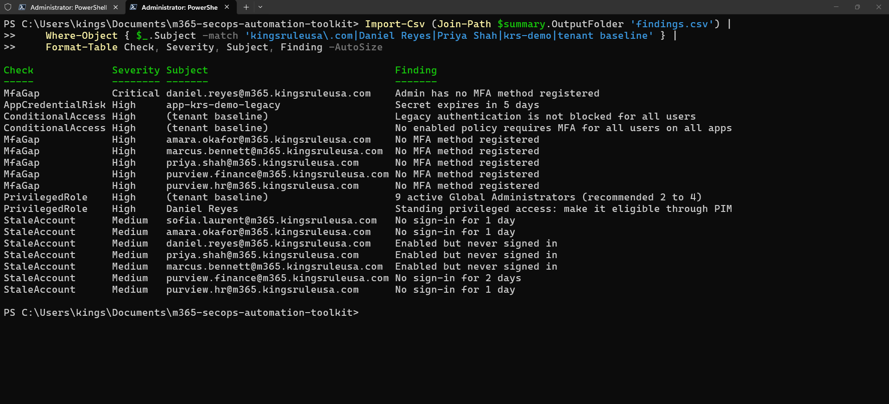
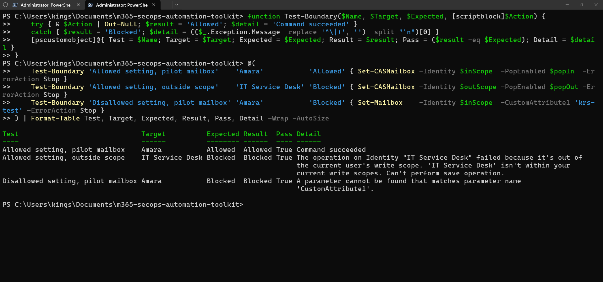
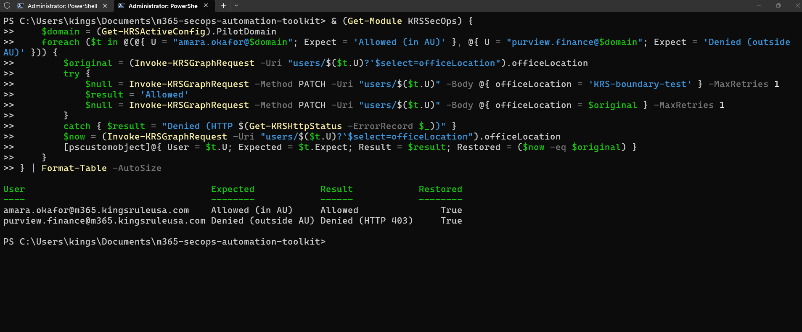

# Toolkit Overview — M365 SecOps Automation Toolkit


[](https://github.com/kingsrule50/m365-secops-automation-toolkit/actions/workflows/ci.yml)

**KRSSecOps is a PowerShell 7 module I built to automate Microsoft 365 security operations safely in a tenant I don't own: certificate-only authentication, least-privilege permissions, a pilot-scoped blast radius, and a tested, CI-verified codebase.**

---

## The Series

| Part | What it does | Status |
| --- | --- | --- |
| **[Part 1 — Identity Posture Audit](../README.md)** | One command runs six identity checks (MFA gaps, stale accounts, standing privileged access, guests, app credentials, Conditional Access) and produces ranked, redacted evidence | ✅ Complete |
| **[Part 2 — Compliance-as-Code](../parts/part-2-compliance-as-code/README.md)** | Baselines Purview labels, DLP and retention and detects drift; checks and enforces mailbox security with an app that Exchange confines to 3 pilot mailboxes and 2 commands | ✅ Complete |
| **[Part 3 — Detection & Safe Containment](../parts/part-3-detection-containment/README.md)** | Correlates rules, audit, sign-in and risk data; contains a compromised account behind a ticket and a second approver, with write access Entra confines to 3 pilot users; recovers from the record and produces a redacted incident report | ✅ Complete |

---

## Headline Results

**Part 1 — Identity posture audit**



- **6 of 6 checks, 0 failures, about 44 seconds** against a live Microsoft 365 E5 tenant
- **Every seeded risk detected**, including an admin with no MFA rated **Critical** from live role data, even though Microsoft's own report hadn't caught up yet
- **6 read-only Graph permissions**, no client secrets, non-exportable certificate

**Part 2 — Compliance-as-code**



- **Exchange itself confines the app:** a write inside the pilot works; outside the scope or outside the role, Exchange refuses it
- **3 seeded risks, 3 High findings:** external forwarding, a malicious inbox rule, and a DLP policy quietly switched to test mode (caught as baseline drift)
- **13 → 6 findings** after `-WhatIf` and enforcement; what remains is deliberately left for a person

**Part 3 — Detection and safe containment**



- **Entra itself confines containment:** the app's only directory role is scoped to an administrative unit; a change inside it works, outside it Graph returns **403**. No tenant-wide write permission
- **Four evidence sources, one view:** the planted forwarding rule rated **High**, with who created it and from where, masked for sharing
- **Contain → recover → report** on ticket INC-1042: 3 actions done, sign-in restored from the record, the malicious rule **kept disabled as evidence**, operator and approver on every row

**Engineering:** 257 Pester tests, 91.6% coverage, CI green on Windows and Ubuntu

---

## Built To Be Safe In A Shared Tenant

| Principle | How |
| --- | --- |
| No secrets | Certificate auth, private key can't be exported; settings, certificates, logs and reports are gitignored, and tests enforce it |
| Least privilege | Per-part permissions, each one justified in [permission-matrix.md](permission-matrix.md); Exchange access through a custom role trimmed to 8 commands; containment through a role scoped to an administrative unit |
| Blast radius | The code refuses changes outside the pilot domain `m365.kingsruleusa.com`; Exchange refuses them outside the tagged pilot mailboxes and Entra outside the administrative unit; output is redacted for sharing |
| Change control | `-WhatIf` on every change; containment needs a ticket and a second approver; every tenant change is approved and logged in [change-log.md](change-log.md) |

---

## Quick Start

```powershell
./setup/01-Install-Prerequisites.ps1
./build/build.ps1                                   # analyze, test, package
Import-Module ./src/KRSSecOps/KRSSecOps.psd1
Connect-KRSTenant
Invoke-KRSIdentityAudit -Scope Pilot -Redact      # Part 1

Connect-KRSCompliance
Invoke-KRSComplianceAudit -Redact                  # Part 2

Find-KRSCompromiseIndicator -UserPrincipalName <upn> -Redact                       # Part 3
Invoke-KRSContainment -UserPrincipalName <upn> -TicketId INC-1042 -ApprovedBy '<approver>' -WhatIf
Export-KRSIncidentReport -UserPrincipalName <upn> -TicketId INC-1042 -Redact
```

Full setup is in the [Part 1](../parts/part-1-identity-audit/runbook.md), [Part 2](../parts/part-2-compliance-as-code/runbook.md) and [Part 3](../parts/part-3-detection-containment/runbook.md) runbooks.

---

## Repository Structure

```text
m365-secops-automation-toolkit/
|-- README.md                       Part 1 write-up (front page)
|-- docs/toolkit-overview.md        this overview
|-- parts/                          Parts 2 and 3 write-ups; runbooks and screenshots for all parts
|-- src/KRSSecOps/                  the module (Public/Core, Identity, Compliance, Response; Private; Config)
|-- setup/                          numbered setup scripts, all with -WhatIf
|-- tests/                          Pester tests, Graph, Exchange and Purview fully mocked
|-- build/                          build.ps1 and analyzer settings
|-- docs/                           permission matrix and tenant change log
|-- .github/workflows/ci.yml        CI on windows-latest and ubuntu-latest
`-- CHANGELOG.md / LICENSE
```

---

*Built by Chinedu Asuzu (CompTIA Security+, Microsoft SC-401) in a shared Microsoft 365 developer tenant with test identities and the tenant owner's approval. Tenant and admin details are redacted from all screenshots.*
