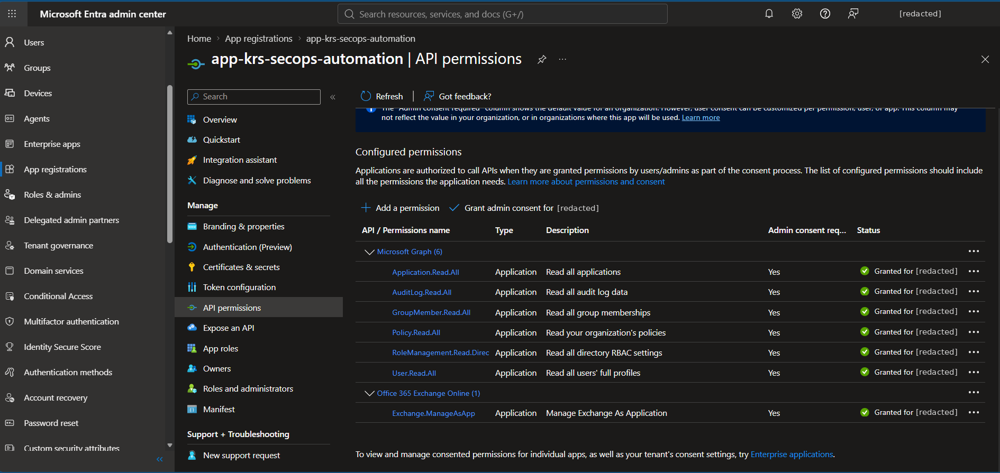
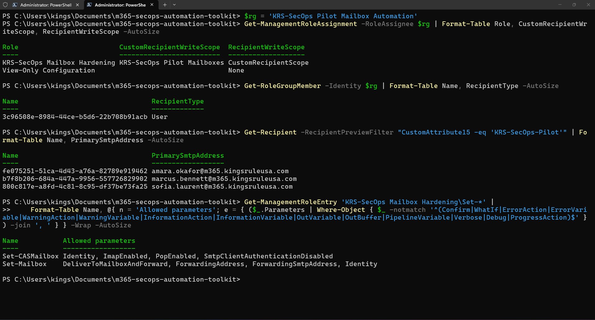
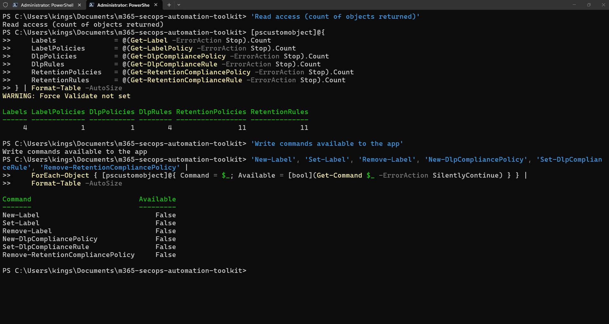
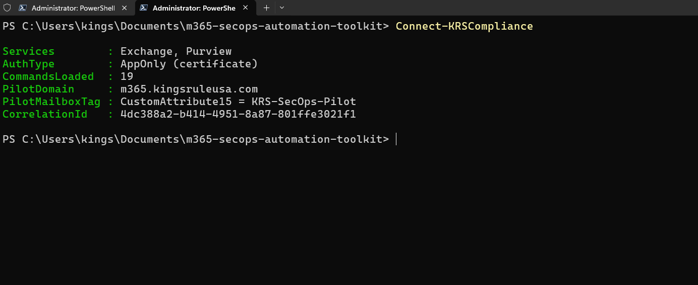
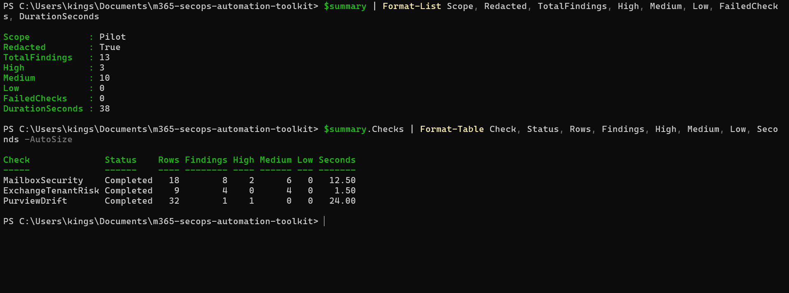
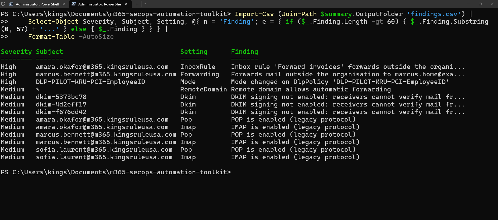
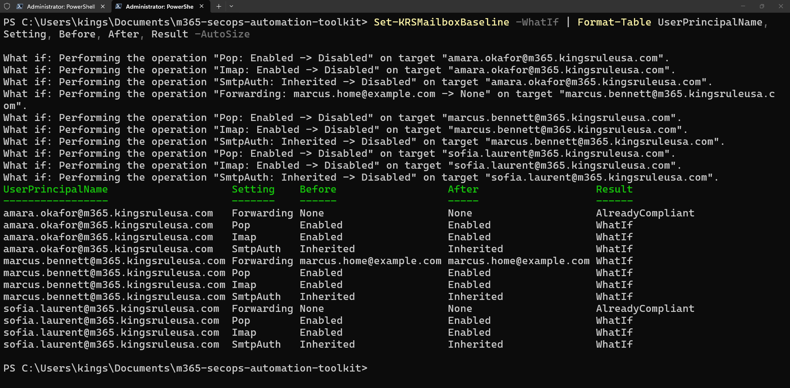
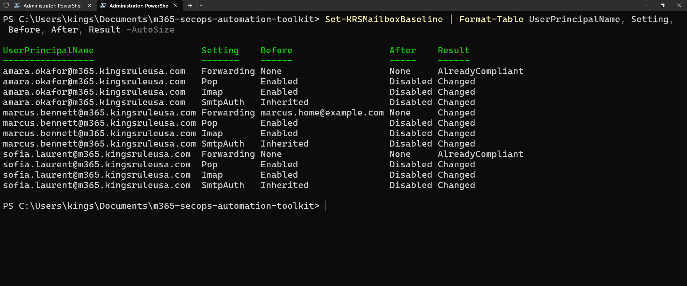
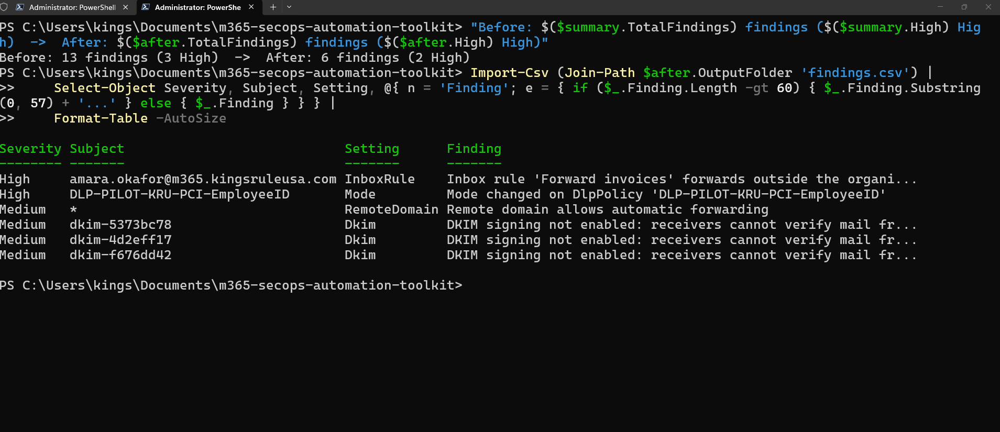

# Part 2: Compliance-as-Code for Exchange Online and Purview — M365 SecOps Automation Toolkit


[](https://github.com/kingsrule50/m365-secops-automation-toolkit/actions/workflows/ci.yml)

**Exchange Online and Microsoft Purview controls managed as code: a version-controlled Purview baseline with drift detection, mailbox security checked and enforced as desired state, and an automation identity that Exchange itself confines to three pilot mailboxes and two commands.**

> **Series:** [Toolkit overview](../../README.md) · [Part 1 — Identity posture audit](../part-1-identity-audit/README.md) · **Part 2 — Compliance-as-code (this page)** · Part 3 — Detection, safe containment and reporting
>
> Step-by-step commands: [runbook.md](runbook.md)

---

## The Problem This Lab Solves

Two of the quietest ways data leaves a Microsoft 365 tenant are **mail forwarding** (a mailbox or an inbox rule that copies mail to an outside address) and **weakened data protection** (a DLP policy switched to test mode, a retention policy removed, a label stripped of encryption). Neither raises an alarm. Both look fine at a glance in the admin portals.

Checking for them by hand is slow and inconsistent, and fixing them by hand leaves no record of what changed. Automating them raises a harder question: **how do you give a script write access to mailboxes in a shared tenant without trusting the script?**

In this part I extended **KRSSecOps** with compliance-as-code for Exchange Online and Purview, and built an automation identity whose write access is enforced **by Exchange, not by my code**: three tagged pilot mailboxes, two commands, seven parameters.

---

## Project Objectives

I designed this part to demonstrate my ability to:

- Connect to **Exchange Online and Security & Compliance PowerShell app-only** with the same non-exportable certificate as Part 1
- Design **Exchange RBAC for applications**: a custom role trimmed to six commands, a management scope, and a role group whose only member is the app
- Prove the boundary **from the app's side**: allowed, blocked outside the scope, blocked outside the role
- Export Purview labels, DLP and retention as a **JSON baseline** and detect **drift** with severity ranking
- Check mailbox security and **enforce it as idempotent desired state** with `-WhatIf`
- Extend redaction from people to **tenant objects** (other tenants' domains and rules) so shared output is safe
- Keep the codebase tested: **201 Pester tests, 90% coverage**, every Exchange and Purview call mocked

---

## Technologies Used

| Area | Technology |
| --- | --- |
| Language | PowerShell 7.4 module (same KRSSecOps module, version 0.2.0) |
| Mail platform | Exchange Online PowerShell (ExchangeOnlineManagement 3.10, REST mode) |
| Compliance | Microsoft Purview via Security & Compliance PowerShell: sensitivity labels, DLP, retention |
| Authorisation | Exchange RBAC for applications: custom management role, management scope, role groups |
| Authentication | Entra ID app, `Exchange.ManageAsApp`, X.509 certificate (CSP key, non-exportable), app-only |
| Testing | Pester 5.9, every Exchange and Purview call mocked at one wrapper |
| CI | GitHub Actions on `windows-latest` and `ubuntu-latest` |

---

## Lab Environment

The same shared **Microsoft 365 E5 developer tenant** and pilot domain **m365.kingsruleusa.com** as Part 1.

| Resource | Purpose |
| --- | --- |
| **app-krs-secops-automation** | Same app as Part 1, plus `Exchange.ManageAsApp`, which grants nothing until a role group does |
| **KRS-SecOps Pilot Mailbox Automation** | Exchange role group: trimmed custom role scoped to the pilot, plus read-only configuration |
| **KRS-SecOps Pilot Mailboxes** | Management scope: mailboxes tagged `CustomAttribute15 = KRS-SecOps-Pilot` |
| **KRS-SecOps Purview Baseline Reader** | Purview role group: three view-only roles |
| **Amara, Marcus, Sofia** | The three licensed pilot mailboxes, the only ones the app can change |
| **IT Service Desk** | Shared mailbox from an earlier lab, inside the pilot email domain but deliberately **not** tagged: the out-of-scope test target |
| **DLP-PILOT-KRU-PCI-EmployeeID** | My DLP policy from the Purview lab, used for the drift scenario |

Every tenant change was approved by the tenant owner and recorded with its rollback in [docs/change-log.md](../../docs/change-log.md).

---

## Architecture and Logical Workflow

**Certificate sign-in → Exchange + Purview app-only sessions (19 commands loaded) → Purview baseline export → Mailbox, organisation and drift checks → Ranked, redacted evidence → `-WhatIf` → Enforce → Re-audit**

**Design decisions I made:**

- **Same identity, no new secret.** The Part 1 certificate already used a legacy CSP key, which Exchange app-only sign-in requires, so I added one permission instead of a second identity or certificate.
- **The server is the boundary, not the script.** Exchange enforces the scope and the role. The code also checks the pilot domain before every write, so there are two independent locks.
- **An explicit tag, not a domain filter.** A mailbox is in scope only if someone deliberately tagged it. A shared mailbox that merely has a pilot-domain address stays out.
- **Report, don't delete.** The app can clear forwarding and turn off legacy protocols, but it cannot delete inbox rules or change auditing. Those are possible evidence and go to a person.
- **Read-only in Purview.** Drift is reported, never auto-reverted: a change to a DLP or retention policy needs a human decision.
- **Baselines stay out of the public repo.** A shared tenant's policy names are not mine to publish, so baselines are written under my user profile by default.

---

# Implementation

## 1. Confirm the Certificate Works for Exchange

Microsoft's documentation says Exchange app-only sign-in does not support CNG certificates. PowerShell 7 reported the key as `RSACng`, which looked like a blocker, but the provider underneath was **Microsoft Base Cryptographic Provider v1.0**, a legacy CSP. `-KeySpec Signature` in Part 1's certificate script had already placed the key in a CSP. No second certificate was needed.

## 2. Add Exchange.ManageAsApp

```powershell
./setup/03-New-KRSAppRegistration.ps1 -TenantId <tenant> -CertificatePath <cer> -Part 2 -WhatIf
./setup/03-New-KRSAppRegistration.ps1 -TenantId <tenant> -CertificatePath <cer> -Part 2
```


*Seven application permissions, all admin-consented. `Exchange.ManageAsApp` lets the app call Exchange, but it has no Entra role, so on its own it can do nothing.*

## 3. Build a Pilot Boundary That Exchange Enforces

I asked Exchange which built-in roles contain each command and parameter the toolkit needs, rather than guessing. The smallest built-in role that can clear forwarding (**Mail Recipients**) can change almost anything on a mailbox, and the role for `-AuditEnabled` (**Audit Logs**) also reaches organisation-wide settings that no recipient scope limits. So I dropped auditing changes entirely and built a custom role instead:

```powershell
./setup/05-Set-KRSExchangePilotRbac.ps1 -PilotMailbox <3 pilot UPNs> -ServicePrincipalId <sp-id> -WhatIf
./setup/05-Set-KRSExchangePilotRbac.ps1 -PilotMailbox <3 pilot UPNs> -ServicePrincipalId <sp-id>
```

The script tags the pilot mailboxes, **stops if the scope filter would match any other mailbox**, creates the scope, clones Mail Recipients and removes 172 entries, limits the two `Set` commands to the forwarding and protocol parameters, and makes the app's service principal the role group's only member.


*The custom role writes only within `KRS-SecOps Pilot Mailboxes`. View-Only Configuration has no write scope. The only member is the app. Exactly three mailboxes are in scope.*

## 4. Prove the Boundary from the App's Side

Signed in as the app, with the certificate only, I ran three writes, each designed to be harmless even if it unexpectedly succeeded:


*An allowed setting on a pilot mailbox works. The same setting on the untagged IT Service Desk mailbox is refused by Exchange as "out of the current user's write scope". A setting outside the role is refused because the parameter does not exist for this app.*

## 5. Give the App Read-Only Access to Purview

Security & Compliance PowerShell can't search roles by command, so I chose the view-only roles by name and proved them live:

```powershell
./setup/06-Set-KRSPurviewReadRbac.ps1 -ServicePrincipalId <sp-id>
```


*The app reads every label, label policy, DLP and retention object. All six commands that create, change or delete policies are not even loaded for it.*

## 6. Connect App-Only to Both Services

```powershell
Connect-KRSCompliance
```


*No browser and no admin account. Each session loads only the commands the toolkit uses: 19 of 19 available, each one backed by a role the app holds.*

## 7. Save the Approved Purview Baseline

```powershell
Export-KRSComplianceBaseline
Compare-KRSComplianceBaseline     # immediately afterwards: 0 rows
```

The baseline captured **32 objects**: 4 labels, 1 label policy, 1 DLP policy with 4 rules, and 11 retention policies with 11 rules. Comparing straight after exporting returned **zero drift**, which proved the comparison is stable against live data before I trusted it.

## 8. Seed Realistic Risks

| Scenario | How I created it (admin) | Expected finding |
| --- | --- | --- |
| Mailbox forwarding | Marcus forwards to `marcus.home@example.com` and keeps a copy | **High**, fixable |
| Malicious inbox rule | Amara: rule `Forward invoices` → `collector@example.net` | **High**, report-only |
| Weakened DLP | My DLP policy switched from `Enable` to `TestWithoutNotifications` | **High** drift |

`example.com` and `example.net` are reserved domains that can never receive mail, and the tenant's outbound policy already blocks external auto-forwarding.

## 9. Run the Compliance Audit

```powershell
$summary = Invoke-KRSComplianceAudit -Redact
```


*3 of 3 checks completed, 0 failed, 13 findings in 38 seconds. Exactly 3 High: one per seeded risk.*


*The three seeded risks are at the top. Other tenants' domains appear as stable masked names (`dkim-5373bc78`). Pilot mailboxes, `*` and my own DLP policy stay readable.*

## 10. Enforce the Mailbox Baseline

```powershell
Set-KRSMailboxBaseline -WhatIf
Set-KRSMailboxBaseline
```


*Ten planned changes, nothing changed. SMTP AUTH is already off for the organisation; enforcement still pins it on each pilot mailbox, so re-enabling it organisation-wide later would not reach them.*


*All ten changes applied by the app, zero failures. Settings already compliant are left alone.*

## 11. Re-Audit


*13 → 6 findings, 3 → 2 High. Everything the app is allowed to fix is fixed. Amara's inbox rule (report-only) and the DLP drift (read-only) remain for a person, and the four organisation-wide findings belong to the tenant owner.*

I then switched the DLP policy back to `Enable`. Amara's inbox rule stays in place as the starting point for Part 3.

---

# Validation Results

| Control / Test | Expected Result | Result |
| --- | --- | --- |
| Certificate works for Exchange | CSP key accepted for app-only sign-in | PASS |
| Least privilege, Exchange | Custom role: 6 commands, 7 write parameters, pilot scope | PASS |
| Scope preview before creation | Filter matches exactly the 3 pilot mailboxes | PASS |
| Boundary: allowed write | Succeeds on a tagged pilot mailbox | PASS |
| Boundary: outside scope | Refused by Exchange (write scope) | PASS |
| Boundary: outside role | Refused by Exchange (parameter not found) | PASS |
| Least privilege, Purview | All reads succeed, 0 of 6 write commands available | PASS |
| Baseline stability | 0 drift rows immediately after export | PASS |
| External mailbox forwarding | Marcus flagged High | PASS |
| External inbox rule | Amara flagged High, report-only | PASS |
| DLP weakened to test mode | Drift flagged High (Mode: Enable → TestWithoutNotifications) | PASS |
| Redaction of tenant objects | Other domains masked, pilot readable | PASS |
| `-WhatIf` | 10 planned changes, 0 made | PASS |
| Enforcement | 10 changed, 0 failed, compliant settings untouched | PASS |
| Re-audit | 13 → 6 findings; only report-only and out-of-scope items remain | PASS |
| Unit tests | 201 passed, 0 failed, 90% coverage | PASS |

---

# Security and Operational Principles Demonstrated

## Server-Enforced Least Privilege

The app's write access is defined in Exchange: one scope, one trimmed role, one member. A bug in my code cannot reach another mailbox or another setting, which I proved rather than assumed.

## Defence in Depth

Every write passes the toolkit's pilot-domain guard first, then Exchange's scope and role. Either alone would stop an out-of-scope change.

## Humans Decide on Evidence and Policy

Inbox rules and audit settings are reported, never changed. Purview drift is reported, never auto-reverted.

## Change Control

`-WhatIf` before every change, idempotent enforcement, every write logged with a correlation ID, and every tenant change recorded with its rollback.

## Data Minimisation

`-Redact` now covers tenant objects as well as people, and baselines stay outside the public repository.

---

# Troubleshooting Lessons

## A Key Type That Looked Like a Blocker

PowerShell 7 reported my certificate key as `RSACng`, and Microsoft says CNG keys don't work for Exchange app-only sign-in. .NET wraps every key in an `RSACng` object, though; the provider underneath was a legacy CSP. I checked the provider instead of the wrapper type and avoided a second certificate.

## A Module File That Lived in the Cloud

The Exchange module failed to load with *"The cloud file provider is not running"*: my per-user PowerShell modules sit in a OneDrive-backed Documents folder, and one file was cloud-only. Loading PowerShellGet from PowerShell's own folder first worked around it, and marking the folder *Always keep on this device* fixed it.

## A Filter That Silently Matched Nothing

My first scope filter, `PrimarySmtpAddress -like '*@domain'`, returned **zero** mailboxes with no error: Exchange's server-side filters don't support a leading wildcard. A scope built on it would have looked fine and protected nothing. I switched to an explicit tag and made the setup script refuse to continue unless the preview matches exactly.

## A Refused Write That Looked Like Success

My first boundary test reported the out-of-scope write as *Allowed*, even though Exchange printed a refusal. The Exchange module generates its commands in a separate module that doesn't inherit `$ErrorActionPreference`, so the error never reached my `catch`. Every Exchange and Purview call in the toolkit now goes through one wrapper that always passes `-ErrorAction Stop`, and a test fails the build if any code calls those commands directly.

## Two Services, Two RBAC Behaviours

Security & Compliance PowerShell doesn't support searching roles by command, and a new role group there can't take members until it has a display name. I proved the read-only roles by testing them as the app, and the setup script now sets and repairs the display name.

## False Drift from Random Ordering

DLP rule conditions come back as hashtables, and .NET randomises hashtable ordering per process. A baseline exported in one session could show drift in the next with nothing changed. I sort dictionary keys before comparing, and a test checks it.

## Redaction Has to Cover More Than People

The first findings table showed other tenants' domain names. Part 1's redaction masked identities, but organisation-wide checks name domains, rules and policies too. `-Redact` now masks any of those that aren't the pilot's, using stable hashed names so findings can still be tracked between runs.

---

# Skills Demonstrated

| Skill | Where |
| --- | --- |
| Exchange Online administration as code | App-only sessions, mailbox and CAS settings, inbox rules, transport, DKIM |
| Exchange RBAC design | Custom role from a parent, entry and parameter trimming, management scope, role groups for apps |
| Microsoft Purview | Labels, label policies, DLP and retention read as code; drift with severity |
| Desired-state enforcement | Idempotent `Set-` with `-WhatIf`, per-setting before/after results |
| Security validation | Boundary proven from the app's side; least privilege proven, not assumed |
| Data protection in shared tenants | Object-level redaction, baselines kept outside the public repo |
| Testing | 201 Pester tests, mocks at one wrapper, standards enforced as tests |
| Troubleshooting | Seven real issues, each traced to a cause and fixed in code or setup |

---

# Why This Matters for the Job

Mail forwarding and quietly weakened data-protection policies are how data leaves organisations without anyone noticing. This part shows I can find both automatically, fix what is safe to fix, route the rest to a person, and do it with an automation identity whose limits are enforced by the platform and proven by testing. That is the difference between a script and something a security team can approve for production.

---

# Project Outcome

**Certificate Identity → Exchange.ManageAsApp → Server-Enforced Pilot Scope → Proven Boundary → Read-Only Purview → Baseline → Seeded Risks → Ranked, Redacted Audit → `-WhatIf` → Enforcement → Re-Audit**

The completed part demonstrates practical skills relevant to:

- Cloud Security Engineer
- Microsoft 365 Security / Messaging Engineer
- Data Protection / Microsoft Purview Engineer
- Security Automation Engineer
- Microsoft 365 Administrator / Engineer

---

## Repository Structure

Part 2 adds these files to the shared toolkit (full layout in the [toolkit overview](../../README.md#repository-structure)):

```text
src/KRSSecOps/
|-- Public/Compliance/              Connect/Disconnect-KRSCompliance, Export/Compare-KRSComplianceBaseline,
|                                   Get-KRSMailboxSecurityState, Set-KRSMailboxBaseline,
|                                   Get-KRSExchangeTenantRisk, Invoke-KRSComplianceAudit
`-- Private/Exchange.ps1            command wrapper, baseline spec, address parsing, object redaction
setup/05-Set-KRSExchangePilotRbac.ps1   pilot tag, scope, trimmed custom role, role group (-WhatIf)
setup/06-Set-KRSPurviewReadRbac.ps1     read-only Purview role group (-WhatIf)
tests/Compliance.Tests.ps1          Part 2 tests, Exchange and Purview fully mocked
parts/part-2-compliance-as-code/
|-- README.md                       this write-up
|-- runbook.md                      step-by-step commands
`-- screenshots/                    01-10
```

---

## Related Labs

- [Microsoft Purview Data Protection Lab](https://github.com/kingsrule50/m365-purview-data-protection) — the sensitivity labels, DLP and retention policies this part baselines
- [Microsoft 365 Exchange Online Enterprise Mail & Security Lab](https://github.com/kingsrule50/m365-exchange-online-enterprise-lab) — the shared mailbox used as the out-of-scope test target

---

## Portfolio Note

I completed this part in a shared Microsoft 365 developer tenant using test identities, a dedicated pilot domain and controlled scenarios, with the tenant owner's approval for every change. Other tenants' domains are masked in all published output, and the tenant owner's organisation name and my administrator account are redacted from every screenshot.
