# Part 3: Detection, Safe Containment and Incident Reporting — M365 SecOps Automation Toolkit


[](https://github.com/kingsrule50/m365-secops-automation-toolkit/actions/workflows/ci.yml)

**Account-compromise detection across mailbox, audit, sign-in and risk data; approval-gated containment that the platform itself limits to three pilot users; reversible recovery; and a redacted incident report that ties every action to a ticket, an operator and an approver.**

> **Series:** [Toolkit overview](../../docs/toolkit-overview.md) · [Part 1 — Identity posture audit](../../README.md) · [Part 2 — Compliance-as-code](../part-2-compliance-as-code/README.md) · **Part 3 — Detection, safe containment and reporting (this page)**
>
> Step-by-step commands: [runbook.md](runbook.md)

---

## The Problem This Lab Solves

When a mailbox is compromised, the first minutes matter: the attacker usually plants an inbox rule that quietly forwards mail outside, and keeps a session alive. A responder needs to answer three questions fast: **is this account compromised, what do I switch off, and what exactly did I do?**

Automating that response raises a harder question than Part 2 did. Containment needs **write access to user accounts**: blocking sign-in and revoking sessions. The obvious Graph permissions for that (`User.EnableDisableAccount.All`, `User.RevokeSessions.All`) are **tenant-wide**. In a tenant I don't own, a script with those permissions could lock out anyone.

In this part I extended **KRSSecOps** with detection, containment, recovery and reporting, and gave the automation identity write access that **Entra ID itself confines to three pilot users** through an administrative unit, with no tenant-wide write permission at all.

---

## Project Objectives

I designed this part to demonstrate my ability to:

- Correlate **four evidence sources** (inbox rules and forwarding, the unified audit log, sign-in logs, Entra ID Protection risk) into ranked indicators per user
- Show a source that **couldn't be read** as "(not checked)" instead of reading silence as "clean"
- Contain an account (**block sign-in, revoke sessions, disable forwarding rules**) behind a ticket ID, a **two-person rule**, `-WhatIf` and a confirmation prompt per step
- Confine the app's directory writes with an **administrative-unit-scoped role** instead of tenant-wide Graph permissions, and **prove the boundary from the app's side**
- Keep malicious rules as **evidence**: disabled, never deleted, and still reported after containment
- Recover from a **JSON containment record**, reversing only what that record shows was done
- Produce a **shareable incident report** (HTML, CSV, JSON) with actors outside the pilot and IP addresses masked
- Keep the codebase tested: **257 Pester tests, 91.6% coverage**, every Graph and Exchange call mocked

---

## Technologies Used

| Area | Technology |
| --- | --- |
| Language | PowerShell 7.4 module (same KRSSecOps module, version 0.3.0) |
| Identity | Microsoft Entra ID: administrative units, scoped role assignment, ID Protection (risky users) |
| Evidence | Microsoft Graph `auditLogs/signIns`, `identityProtection/riskyUsers`; Exchange `Search-UnifiedAuditLog`, `Get-InboxRule` |
| Containment | Graph `PATCH users/{id}` (accountEnabled), `revokeSignInSessions`; Exchange `Disable-InboxRule` |
| Authorisation | Entra User Administrator scoped to an administrative unit; Exchange RBAC for applications (Part 2 role, extended) |
| Authentication | Same Entra ID app and non-exportable X.509 certificate as Parts 1 and 2, app-only |
| Testing | Pester 5.9, Graph and Exchange mocked at one wrapper each |
| CI | GitHub Actions on `windows-latest` and `ubuntu-latest` |

---

## Lab Environment

The same shared **Microsoft 365 E5 developer tenant** and pilot domain **m365.kingsruleusa.com** as Parts 1 and 2.

| Resource | Purpose |
| --- | --- |
| **app-krs-secops-automation** | Same app, plus one read-only Graph permission: `IdentityRiskyUser.Read.All` |
| **KRS-SecOps Pilot Containment** | Entra administrative unit containing Amara, Marcus and Sofia, and nobody else |
| **User Administrator @ that unit** | The app's only directory role, scoped to the unit, not the tenant |
| **KRS-SecOps Mailbox Hardening** | Part 2's custom Exchange role, plus `Disable-InboxRule` and `Enable-InboxRule` (8 commands, still pilot-scoped) |
| **View-Only Audit Logs** | Added to the app's Exchange role group so detection can read who created rules |
| **Amara Okafor** | The "compromised" account: the `Forward invoices` rule planted in Part 2 forwards to `collector@example.net` |
| **purview.finance** | A pilot-domain user deliberately **outside** the unit: the out-of-boundary test target |

Every tenant change was approved by the tenant owner and recorded with its rollback in [docs/change-log.md](../../docs/change-log.md).

---

## Architecture and Logical Workflow

**Certificate sign-in → Graph + Exchange app-only sessions in one PowerShell session → Detect (rules, audit, sign-ins, risk) → `-WhatIf` → Approved containment (block, revoke, disable rule) → Containment record → Re-detect → Recovery from the record → Incident report**

**Design decisions I made:**

- **An administrative unit, not a tenant-wide permission.** Graph has narrow write permissions for exactly these actions, but none of them can be scoped. User Administrator scoped to an administrative unit can be, and Entra enforces it: the app can act on three people and is refused for everyone else.
- **Two independent locks again.** The code refuses accounts outside the pilot domain before any call; Entra and Exchange refuse anything outside the unit and the tagged mailboxes even if the code had a bug.
- **Two people for every change.** Containment and recovery need a ticket ID and an approver who is not the operator, and both names are written to the record and the report.
- **Evidence is never destroyed.** Rules are disabled, not deleted. A disabled rule stays in detection output as *Low: contained, awaiting review* until a person removes it.
- **Recovery is driven by the record.** Undo reverses only what the record shows was done, re-enables sign-in only if the account was enabled before, and keeps the malicious rule disabled unless explicitly told otherwise.
- **Silence is not a clean result.** Each evidence source is read independently; one that fails becomes an Info row saying it wasn't checked and why.

---

# Implementation

## 1. Add the One New Graph Permission

```powershell
./setup/03-New-KRSAppRegistration.ps1 -TenantId <tenant> -CertificatePath <cer> -Part 3 -WhatIf
./setup/03-New-KRSAppRegistration.ps1 -TenantId <tenant> -CertificatePath <cer> -Part 3
```

Part 3 adds only `IdentityRiskyUser.Read.All`. Sign-in logs use `AuditLog.Read.All`, granted in Part 1. I had planned two write permissions for containment and removed them before granting anything (see step 2).

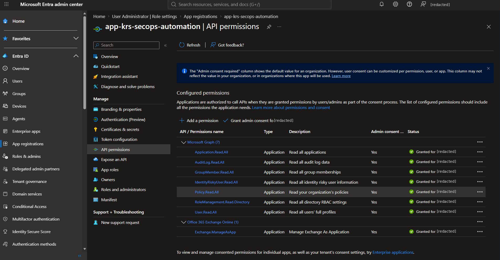
*Eight application permissions, all consented, none of them a Graph write permission. Every write the app makes comes from the scoped roles below.*

## 2. Build the Containment Boundary

```powershell
# Admin Graph session
Connect-MgGraph -Scopes AdministrativeUnit.ReadWrite.All, RoleManagement.ReadWrite.Directory, User.Read.All
./setup/07-Set-KRSContainmentRbac.ps1 -Component Entra -PilotUser <3 pilot UPNs> -ServicePrincipalId <sp-id> -WhatIf
./setup/07-Set-KRSContainmentRbac.ps1 -Component Entra -PilotUser <3 pilot UPNs> -ServicePrincipalId <sp-id>

# Admin Exchange session
./setup/07-Set-KRSContainmentRbac.ps1 -Component Exchange -WhatIf
./setup/07-Set-KRSContainmentRbac.ps1 -Component Exchange
```

The Entra component refuses any user outside the pilot domain, creates the administrative unit, adds the three pilot users and assigns the app **User Administrator with `directoryScopeId = /administrativeUnits/{id}`**. The Exchange component adds the two inbox-rule commands to the Part 2 custom role (after checking they exist in its parent role) and adds the read-only **View-Only Audit Logs** role.

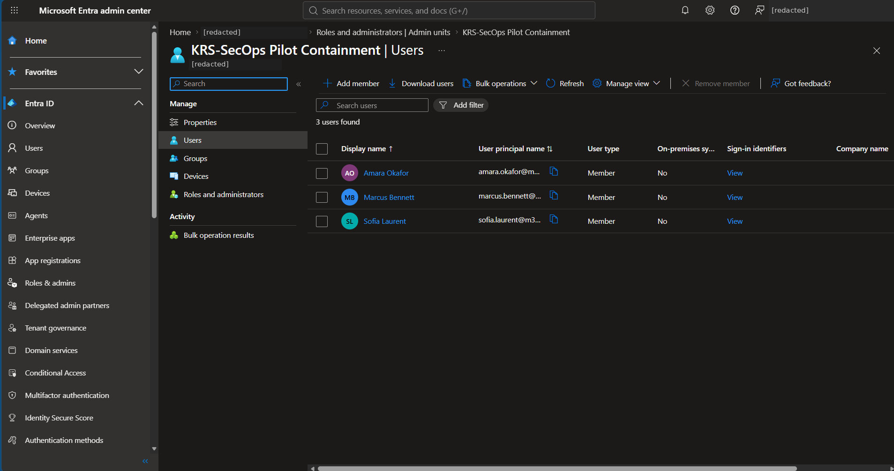
*`KRS-SecOps Pilot Containment` holds exactly the three licensed pilot users.*

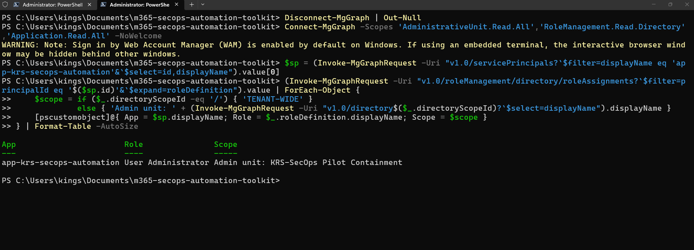
*Read from the directory with Graph: one role, User Administrator, scoped to the administrative unit. No tenant-wide row. (The portal's PIM view doesn't list this kind of assignment; see Troubleshooting.)*

## 3. Prove the Boundary from the App's Side

Signed in as the app, I made a real, reversible change (`officeLocation` set to a marker, then restored) on a user inside the unit and on a pilot-domain user outside it:


*Inside the unit: allowed. Outside it: Graph refuses with HTTP 403. Both values restored. My first version of this test wrote back the current value and "passed" for the wrong reason (see Troubleshooting).*

## 4. Detect

```powershell
Find-KRSCompromiseIndicator -UserPrincipalName <upn> -Days 7 -Redact -IncludeCompliant
```

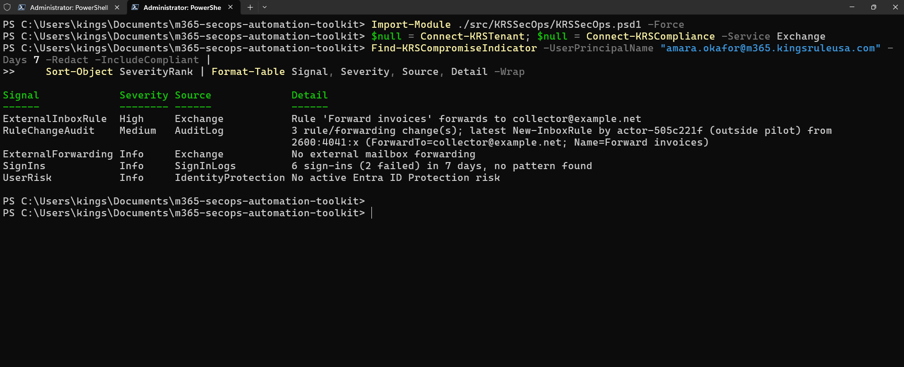
*All four sources read in one app-only session. The forwarding rule is High. The unified audit log shows who created it and from where: the admin is masked as `actor-505c221f (outside pilot)` and the IP shortened to `2600:4041:x`. Sign-ins and risk were read and found no pattern.*

| Signal | Severity | Source |
| --- | --- | --- |
| ExternalInboxRule | High if enabled; Low once disabled ("contained, awaiting review") | Exchange |
| ExternalForwarding | High | Exchange |
| RuleChangeAudit | Medium: who, when, from where, which parameters | Unified audit log |
| FailedSignIns | Medium at 3+, High at 10+ in the window | Sign-in logs |
| LegacySignIn | Medium: successful sign-in over a basic-auth protocol | Sign-in logs |
| MultipleCountries | Medium: successful sign-ins from more than one country | Sign-in logs |
| UserRisk | Critical / High / Medium for ID Protection high / medium / low | Graph riskyUsers |
| AccountState | Info: sign-in already blocked | Directory |

## 5. Preview Containment

```powershell
Invoke-KRSContainment -UserPrincipalName <upn> -TicketId INC-1042 -ApprovedBy '<approver>' -WhatIf
```

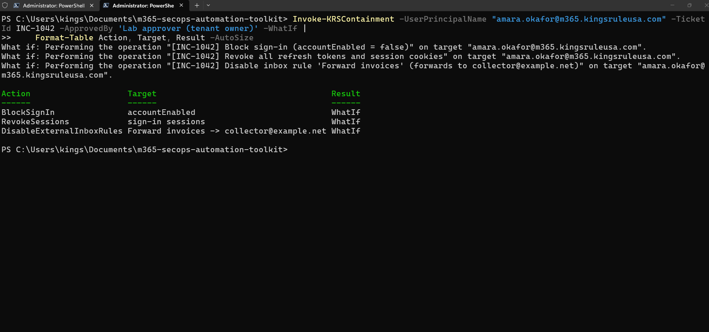
*Three planned steps, each tagged with the ticket. The rule's forwarding target is in the preview, so the approver sees exactly what is being switched off. Nothing changed and no record was written.*

## 6. Contain

```powershell
$contain = Invoke-KRSContainment -UserPrincipalName <upn> -TicketId INC-1042 -ApprovedBy '<approver>'
```

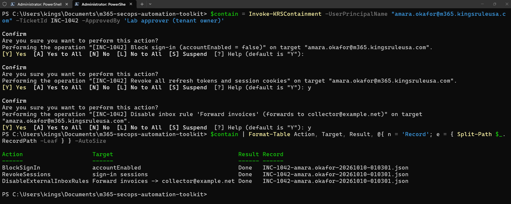
*One confirmation per step (`ConfirmImpact = High`). Sign-in blocked through the scoped role, all sessions revoked, the rule disabled through the pilot-scoped Exchange role. One JSON record holds the before state, each action, the operator and the approver.*

## 7. Re-Detect

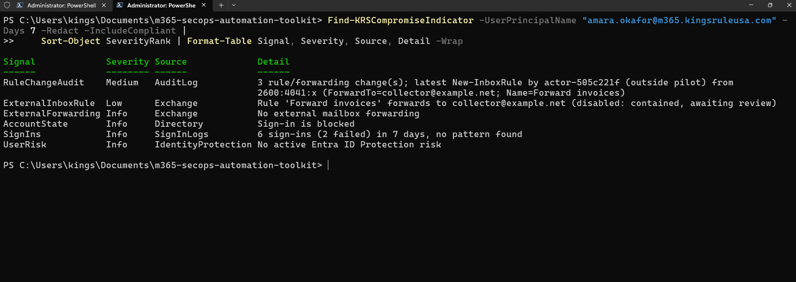
*The rule drops from High to Low and stays visible as evidence. "Sign-in is blocked" appears. The audit trail of who planted the rule is unchanged.*

## 8. Recover

```powershell
$undo = Undo-KRSContainment -RecordPath $contain[0].RecordPath -ApprovedBy '<approver>'
```

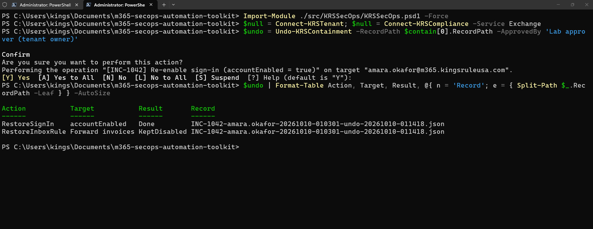
*Sign-in restored because the record shows containment blocked it and the account was enabled before. The forwarding rule is **KeptDisabled**: a planted rule should be reviewed and deleted by a person, not switched back on. The undo record is linked to the original by name.*

In a real incident, recovery comes after a password reset and MFA re-registration. Revoked sessions can't be "undone"; the user simply signs in again.

## 9. Report

```powershell
$report = Export-KRSIncidentReport -UserPrincipalName <upn> -TicketId INC-1042 -Days 7 -Redact
```

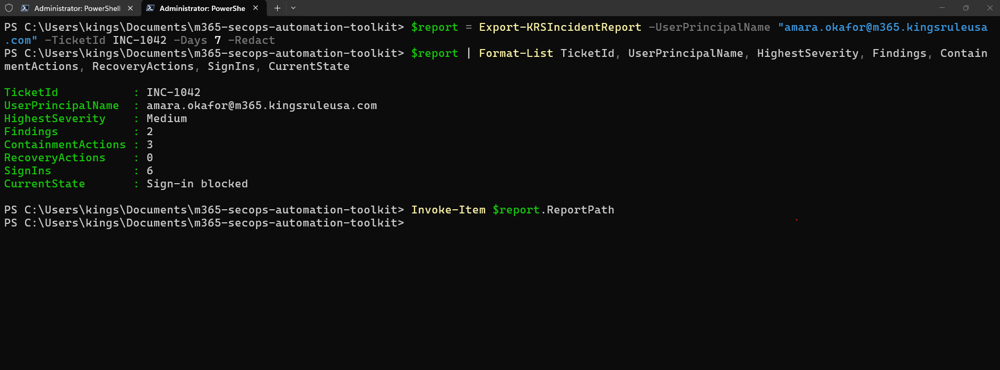

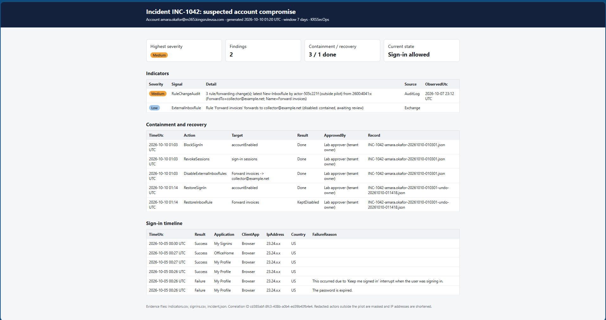
*One page per ticket: severity, findings, containment and recovery counts, current state; then indicators, every action with its operator and approver, and the sign-in timeline with IP addresses shortened. The same data is saved as `indicators.csv`, `signins.csv` and `incident.json`.*

## 10. Build

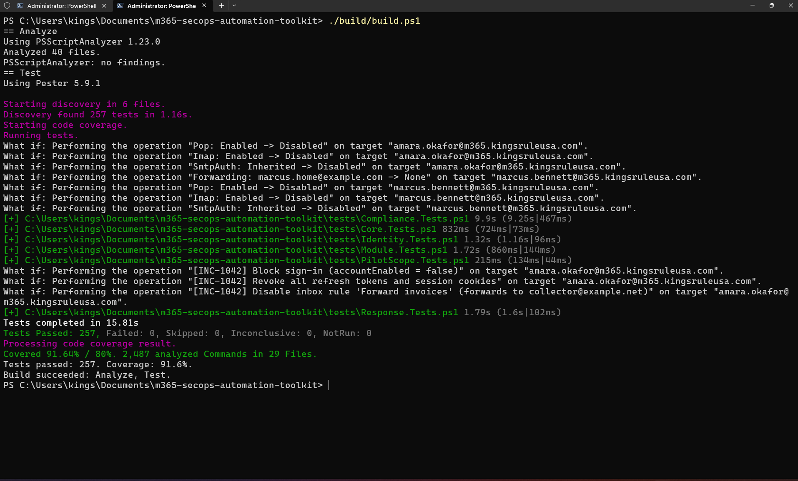
*PSScriptAnalyzer: no findings across 40 files. 257 tests passed, 0 failed. 91.6% coverage against an 80% gate.*

---

# Validation Results

| Control / Test | Expected Result | Result |
| --- | --- | --- |
| Least privilege, Graph | One new permission, read-only; no Graph write permission | PASS |
| App's directory role | Exactly one: User Administrator scoped to the administrative unit | PASS |
| Boundary: inside the unit | Real change allowed, then restored | PASS |
| Boundary: outside the unit | Refused by Graph (HTTP 403) | PASS |
| Graph and Exchange in one session | Both app-only, 16 Exchange commands loaded | PASS |
| Audit log read app-only | Rule creation found: operation, actor, IP, parameters | PASS |
| External forwarding rule | Flagged High | PASS |
| Redaction | Outside actor hashed, IP shortened (including IPv6 with brackets and port) | PASS |
| Two-person rule | Approver equal to the operator refused (unit tested) | PASS |
| Ticket format | Free text refused; `INC-1042` accepted (unit tested) | PASS |
| `-WhatIf` | 3 planned actions, 0 made, no record written | PASS |
| Containment | Block, revoke, disable rule: 3 Done, 0 Failed | PASS |
| Evidence kept | Disabled rule still reported (Low) after containment | PASS |
| Recovery | Sign-in restored; rule kept disabled; undo record written | PASS |
| Incident report | Containment and recovery with operator and approver; redacted | PASS |
| Unit tests | 257 passed, 0 failed, 91.6% coverage | PASS |

---

# Security and Operational Principles Demonstrated

## Platform-Enforced Least Privilege

The app can write to three user accounts and three mailboxes, and the platforms enforce it: an administrative unit in Entra and a management scope in Exchange. I proved both from the app's side.

## Separation of Duties

Every containment and recovery needs a ticket and an approver who is not the operator. The report shows both names on every action.

## Preserve Evidence

Rules are disabled, not deleted, and stay in detection output until a person reviews them. The audit history of who created them is never touched.

## Reversible, Recorded Change

`-WhatIf` and a confirmation per step before anything changes; a JSON record of the before state and every result; recovery driven only by that record.

## Data Minimisation

Actors outside the pilot become stable hashed names, IP addresses are shortened, and containment records and reports are written outside the repository.

---

# Troubleshooting Lessons

## A Boundary Test That Passed for the Wrong Reason

My first Entra boundary test wrote each user's current `accountEnabled` value back. Both the user inside the unit and the one outside it came back *Allowed*. The role assignment was correct; the test was wrong: a PATCH that changes nothing proved nothing about the permission. A real, reversible change (`officeLocation` set and restored) gave the expected result: allowed inside, 403 outside. **A test must make the action it's testing actually happen.**

## A Redaction Gap in IP Addresses

The first detection run showed `from [2600:4041:x`. Audit log IP addresses can carry brackets and a port (`[ipv6]:port`), which my masking didn't expect. Worse, an IPv4 address with a port would have passed through **unmasked**. Masking now strips brackets, ports and the `::ffff:` prefix first, and anything it doesn't recognise is withheld as `x.x.x.x` instead of shown.

## The Admin's Domain Leaked Through a Masked Name

Masking the audit actor as `k***@<domain>` still published the tenant owner's domain. Actors outside the pilot are now hashed as a whole, domain included: `actor-505c221f (outside pilot)`, stable between runs so events can still be correlated.

## Audit Times Four Hours Off

The audit log's `CreationTime` is UTC but carries no time-zone marker, so `ConvertFrom-Json` read it as local time and every event moved four hours. The parser now marks those values as UTC explicitly, and a test checks it.

## Contained Evidence Disappeared

After containment, the disabled rule vanished from detection, which reads as "clean". A disabled forwarding rule is still evidence, so it is now reported as Low, "contained, awaiting review", until a person deletes it.

## The Portal Didn't Show the App's Role

The User Administrator **Assignments** page is the Privileged Identity Management view in a P2 tenant, and it didn't list the app's administrative-unit-scoped assignment, even though the 403/allowed test proved it was in force. I verified it from the directory with Graph instead, with an admin session, because the app itself deliberately can't read administrative units.

## A Verb the Analyzer Rejected

PSScriptAnalyzer flagged `New-KRSIncidentReport` for missing `ShouldProcess`: `New-` implies a change to the system, but the function only writes report files. I renamed it `Export-KRSIncidentReport`, which describes what it does, instead of suppressing the rule.

## "Other." on Successful Sign-ins

The first report showed a failure reason, "Other.", on successful sign-ins: Graph fills the field even when nothing failed. Only failed sign-ins carry a reason now.

---

# Known Limitations

- **The two-person rule is a check, not an identity proof.** The approver is compared with the operator's Windows username. A different name for the same person would pass. In production, approval would come from the ticketing system, not a parameter.
- **User Administrator is broader than block and revoke.** Within the unit, the app could also reset passwords or edit profiles of those three users. I accepted that because Graph's narrow permissions can't be scoped at all; the unit limits it to three test accounts, and User Administrator can't act on administrators.
- **The audit read is tenant-wide.** View-Only Audit Logs can't be scoped to mailboxes. The toolkit keeps only records about the pilot mailbox it is investigating and masks every actor outside the pilot.
- **Audit and sign-in data arrive late.** Both logs can lag by minutes, so a very recent change may not appear on the first run.

---

# Skills Demonstrated

| Skill | Where |
| --- | --- |
| Incident detection and correlation | Rules, forwarding, unified audit log, sign-ins and ID Protection in one ranked view |
| Incident response automation | Block, revoke and disable with `-WhatIf`, per-step confirmation and records |
| Entra ID authorisation design | Administrative unit, role scoped to the unit, proven boundary |
| Exchange RBAC | Extending a pilot-scoped custom role; read-only audit access |
| Separation of duties | Ticket, operator and approver on every change |
| Evidence handling | Rules preserved, audit trail untouched, records and reports kept outside the repo |
| Secure reporting | HTML-encoded, redacted report with CSV and JSON evidence |
| Testing | 257 Pester tests, 91.6% coverage, standards enforced as tests |
| Troubleshooting | Eight real issues, each traced to a cause and fixed in code or setup |

---

# Why This Matters for the Job

Account compromise is one of the most common incidents a Microsoft 365 security team handles, and the first response (block, revoke, kill the forwarding rule) is the same every time. This part shows I can automate that response so it is fast and repeatable, while keeping the controls an auditor expects: a boundary the platform enforces, two people on every change, evidence preserved, every action recorded and reversible, and a report that can be shared without leaking data. That is the difference between a response script and an automation a security team can trust with write access.

---

# Project Outcome

**Scoped Containment Role → Proven Boundary → Four-Source Detection → `-WhatIf` → Approved Containment → Record → Re-Detection → Record-Driven Recovery → Redacted Incident Report**

The completed series now covers the whole loop: **audit** identity posture (Part 1), **enforce** mail and data-protection baselines (Part 2), and **detect, contain and report** on compromise (Part 3), with one module, one certificate identity and no tenant-wide write permission.

The completed part demonstrates practical skills relevant to:

- Cloud Security Engineer
- Security Operations / Incident Response Analyst
- Microsoft 365 Security Engineer
- Security Automation Engineer
- Identity and Access Management Engineer

---

## Repository Structure

Part 3 adds these files to the shared toolkit (full layout in the [toolkit overview](../../docs/toolkit-overview.md#repository-structure)):

```text
src/KRSSecOps/
|-- Public/Response/                Find-KRSCompromiseIndicator, Invoke-KRSContainment,
|                                   Undo-KRSContainment, Export-KRSIncidentReport
`-- Private/Response.ps1            sign-ins, risk, audit search, rule lookup, IP and actor masking
setup/07-Set-KRSContainmentRbac.ps1 administrative unit, scoped User Administrator, Exchange additions (-WhatIf)
tests/Response.Tests.ps1            Part 3 tests, Graph and Exchange fully mocked
parts/part-3-detection-containment/
|-- README.md                       this write-up
|-- runbook.md                      step-by-step commands
`-- screenshots/                    01-12
```

---

## Related Labs

- [Microsoft 365 Exchange Online Enterprise Mail & Security Lab](https://github.com/kingsrule50/m365-exchange-online-enterprise-lab) — the mailbox and transport foundations this part's mailbox containment builds on
- [Microsoft Purview Data Protection Lab](https://github.com/kingsrule50/m365-purview-data-protection) — the data-protection controls Part 2 baselines

---

## Portfolio Note

I completed this part in a shared Microsoft 365 developer tenant using test identities, a dedicated pilot domain and a controlled scenario, with the tenant owner's approval for every change. The "compromise" was a forwarding rule I planted to reserved `example.net` addresses that can never receive mail. Actors outside the pilot are hashed and IP addresses shortened in all published output, and the tenant owner's organisation name and my administrator account are redacted from every screenshot.
